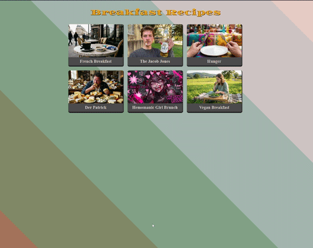

# The Odin Project - Recipes

> This repository is completed as part of [The Odin Project](https://www.theodinproject.com/) curriculum.

---

## 📚 Project: Recipes

> [!NOTE]
> *"The website will consist of a main index page which will have links to a few recipes. The website won't look very pretty by the time you've finished but it's important to keep in mind that the purpose of this project is to build your HTML chops."* 

**🔗 Project link:** [https://www.theodinproject.com/lessons/foundations-recipes](https://www.theodinproject.com/lessons/foundations-recipes)

---

## 🖼️ Result

A quick preview of the Recipes end result

---

## 📜 License

This project is licensed under the **MIT License**. You are free to:

- Use, modify, and distribute the project
- Sublicense the project

For more details, please refer to the [LICENSE](./LICENSE).
